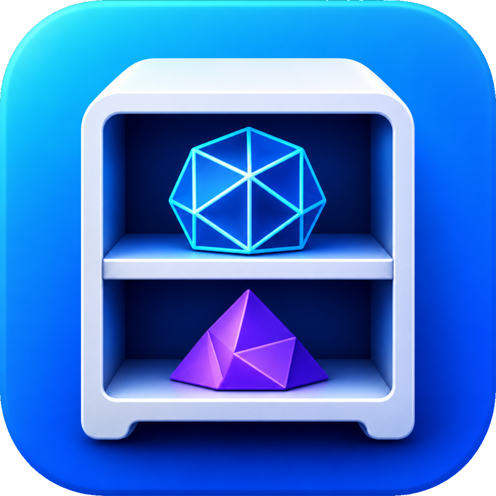

<p align="center">
  
</p>

<h1 align="center">Poly Shelf</h1>

<p align="center">
  <strong>Your 3D model library, organized in place.</strong>
</p>

<p align="center">
  A native macOS app that indexes, previews, tags, and searches your existing
  folders of 3D model files — STL, 3MF, OBJ, STEP, GCODE, and more —
  <strong>without ever moving, renaming, or modifying a file on disk.</strong>
</p>

---

## Why Poly Shelf

If you 3D print, your models are scattered across downloads, project folders,
and external drives. Poly Shelf gives you one calm shelf to browse them all —
while leaving every original file exactly where it is.

- **Read-only by design.** The app opens your files with a sandbox entitlement
  that makes writes to your folders fail at the OS level. Your library is never
  at risk. See [The invariant](#the-invariant).
- **Rich previews.** Thumbnails rendered from geometry (SceneKit), embedded
  previews, GCODE/blend extraction, and QuickLook fallback.
- **Fast search.** Full-text search (FTS5) across names, tags, and metadata.
- **Tagging, manual and AI.** Auto-tag by format and folder, or generate tags
  with an OpenAI-compatible endpoint.
- **Live folder watching.** FSEvents keeps the library in sync as files change.
- **Find duplicates.** Content-hash comparison finds identical models stored in
  different places.
- **Import / export metadata** without touching the source files.

## Download

Grab the latest signed build from the **[Releases page](https://github.com/MahdiMajidzadeh/poly-shelf/releases)**.

1. Download `PolyShelf-vX.Y.Z.zip` from the newest release.
2. Unzip it and drag **Poly Shelf.app** into your `/Applications` folder.
3. The app is ad-hoc signed, so on first launch macOS Gatekeeper will warn you.
   **Right-click the app → Open**, then confirm. You only need to do this once.

   If macOS still blocks it, clear the quarantine flag from Terminal:

   ```sh
   xattr -dr com.apple.quarantine "/Applications/Poly Shelf.app"
   ```

Requires **macOS 14 (Sonoma)** or later.

## Architecture

- `PolyShelfCore/` — SwiftPM package, no UI: GRDB database (FTS5 search),
  scanner (xxHash64 incremental, inode/hash rename matching), format registry,
  parsers (STL sniffer, 3MF zip reader, GCODE/blend thumbnail extractors,
  ModelIO stats), thumbnail pipeline (SceneKit offscreen → embedded → QuickLook
  → icon), auto-tagger, AI tagging client (OpenAI-compatible), export/import,
  FSEvents watcher, duplicate finder.
- `PolyShelf/` — SwiftUI app target: library grid, sidebar, detail inspector,
  settings, About window. AppKit interop for NSOpenPanel/NSWorkspace.
- `project.yml` — XcodeGen manifest (sandbox entitlements, read-only
  user-selected files).

## The invariant

The app opens user files **read-only**. The sandbox entitlement is
`com.apple.security.files.user-selected.read-only`, so writes to watched
folders fail at the OS level. Verify any build with:

```sh
scripts/verify-nondestructive.sh snapshot ~/path/to/test-corpus
# ... exercise the app fully ...
scripts/verify-nondestructive.sh verify ~/path/to/test-corpus
```

Any code path that obtains a writable handle to a file inside a watched folder
is a bug.

## Running from source

### With Xcode (primary path)

Requirements: **Xcode 15+** (macOS 14 SDK), [XcodeGen](https://github.com/yonaskolb/XcodeGen)
(`brew install xcodegen`).

```sh
xcodegen generate          # produces PolyShelf.xcodeproj (gitignored)
open PolyShelf.xcodeproj   # build & run the PolyShelf scheme
```

### Without Xcode (SwiftPM only)

Build a signed, sandboxed `PolyShelf.app` with just the Swift toolchain — this
is what the release CI runs:

```sh
scripts/build-app.sh release   # produces dist/PolyShelf.app
open dist/PolyShelf.app
```

### Core package

Core logic lives in the local Swift package `PolyShelfCore` and can be built
and tested standalone:

```sh
cd PolyShelfCore
swift build
swift test                 # requires Xcode (XCTest is not in the CLT)
```
